# CarRental 
___

这是一个汽车租赁的简单应用，包括增加车辆、修改车辆、删除车辆、查看所有车辆、租赁车辆、手动还车以及查看租车单

## 用到的主要技术

- Java 8
- Spring Boot
- MyBatis-Plus
- MySQL
- Lombok
- Log4j2
- jUnit
- Mockito
- Maven

## Description

#### Features
这个demo实现了以下接口

用户可以

- 查看所有车辆
- 查询用户对应的租车单
- 添加车辆
- 修改车辆
- 删除车辆
- 租赁车辆
- 归还车辆

#### 数据库
数据库主要使用MySQL，ORM框架使用的是MyBatis-Plus，主要涉及三张表，用户表、车辆表、租车单表，
表设计如下：
- 用户表
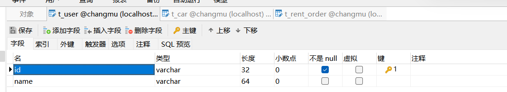
- 车辆表
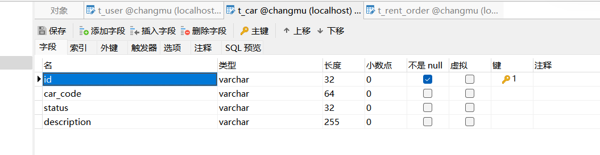
- 租车单表
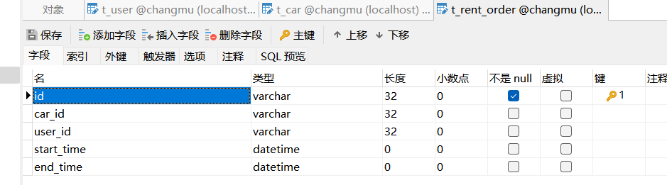
相关的建表语句在src/main/resource/data.sql体现

#### 类设计
- 三个实体类  用户(User)、车辆(Car)、租车单(RentOrder)
- 三个dto 车辆dto(CarDto)、租赁dto(RentDto)、归还dto(ReturnDto)
- 两个异常类设计 RentalError、RentalException

#### 工具类
- 日期工具类 DateUtils
- 雪花算法工具类 SnowFlakeIdUtil
- redis分布式锁帮助类 RedisDistributedLocker
- redis锁工具类 RedisLockUtil
- Spring工具类 SpringUtil

#### 关键设计
项目demo关键主要体现在租车和还车
- 租车
租车的时候对车辆进行加锁，锁的有效时间即为租车持续时间
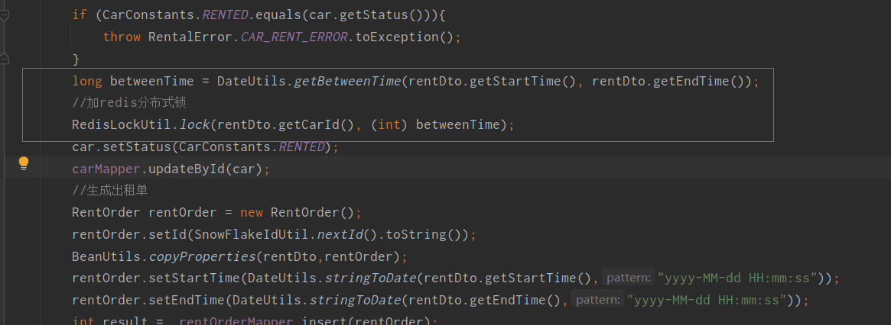
- 还车
判断redis锁是否还存在，存在就将锁删除
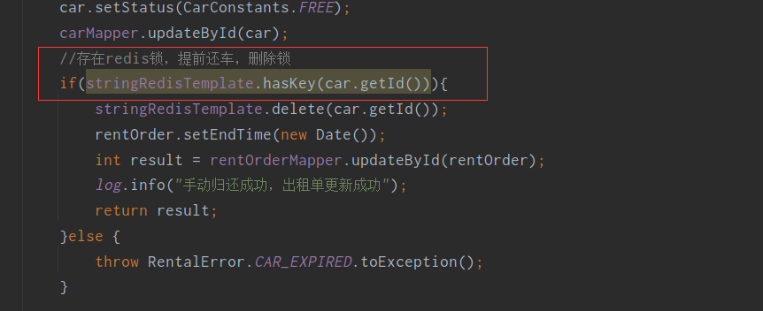
#### 测试

控制器所有的接口都通过了测试，测试用例代码在com.changmu.test.CarRentalControllerTest中 

### Services
___
#### 1) GET: /car/all
Response: HTTP 200 OK

    [
        {
            "id": "1519572275039440896",
            "carCode": "A66666",
            "status": "0",
            "description": "第一辆车牛皮"
        },
        {
            "id": "1519573111459155968",
            "carCode": "A88888",
            "status": "1",
            "description": "第二辆车"
        },
        {
            "id": "1519644587939991552",
            "carCode": "G77777",
            "status": "0",
            "description": "第三辆车"
        },
        {
            "id": "1519646546889674752",
            "carCode": "G99999",
            "status": "0",
            "description": "第四辆车"
        }
    ]
___
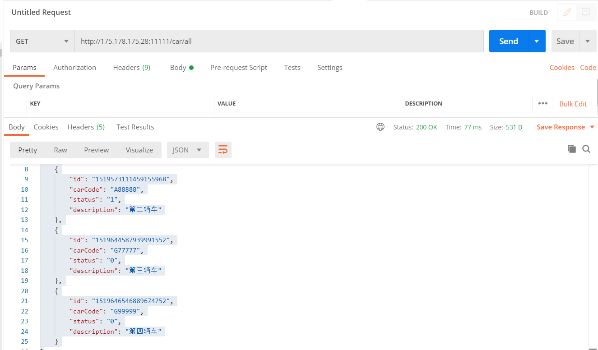
#### 2) GET: /car/rentOrders?userId=1519572275039440898
Response: HTTP 200 OK

    [
        {
            "id": "1519649247111286784",
            "userId": "1519572275039440898",
            "carId": "1519572275039440896",
            "startTime": "2022-04-28 18:15:23",
            "endTime": "2022-04-28 20:44:54"
        },
        {
            "id": "1519649506696761344",
            "userId": "1519572275039440898",
            "carId": "1519573111459155968",
            "startTime": "2022-04-28 18:15:23",
            "endTime": "2022-04-29 18:15:23"
        }
    ]
___
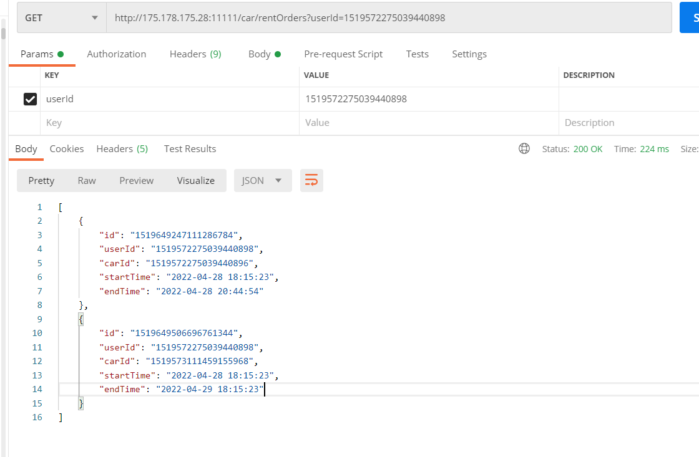
##### 3) POST: /car/add
Request body:

    {
        "carCode":"P777788",
        "description":"第五辆车"
    }

Response: HTTP 200 OK
___
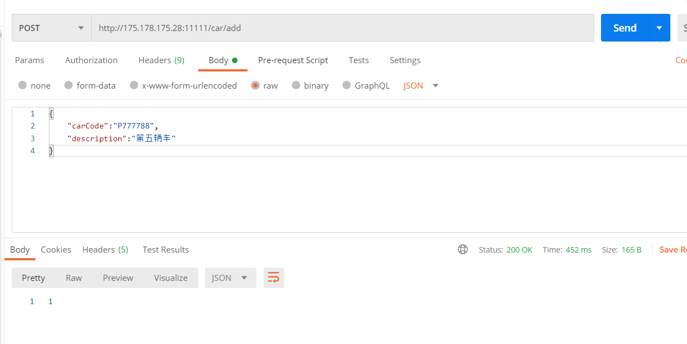
##### 4) POST: /car/update
Request body:

    {
        "id":"1519572275039440896",
        "carCode":"A66666",
        "description":"第一辆车不行"
    }

Response: HTTP 200 OK
___
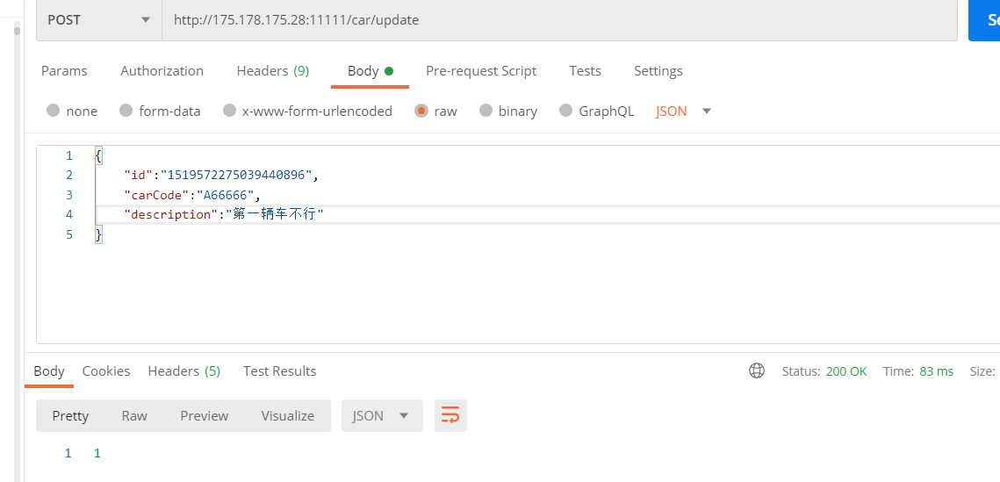
##### 5) POST: /car/remove
Request body:

     {
         "id":"1519572275039440896",
     }

Response: HTTP 200 OK
___
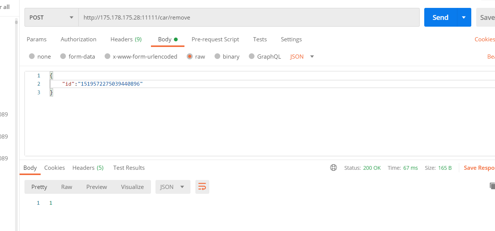
##### 6) POST: /car/rent
Request body:

     {
          "userId":"1519572275039440898",
          "carId":"1519644587939991552",
          "startTime":"2022-04-28 18:15:23",
          "endTime":"2022-04-30 18:15:23"
     }

Response: HTTP 200 OK
___
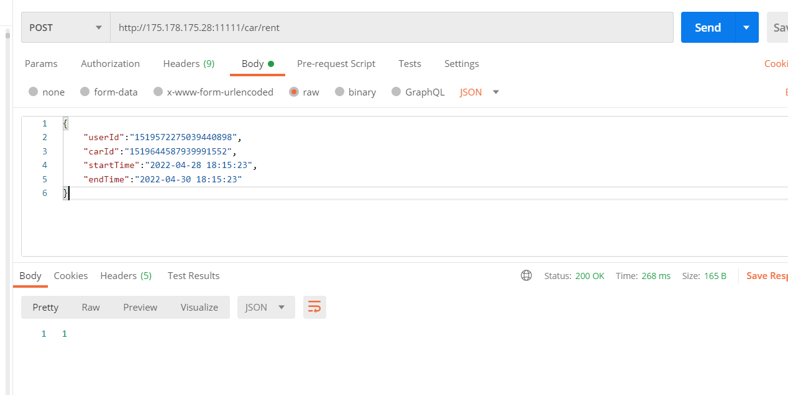
##### 7) POST: /car/return
Request body:

     {
          "rentOrderId":"1519649506696761344";
     }

Response: HTTP 200 OK
___
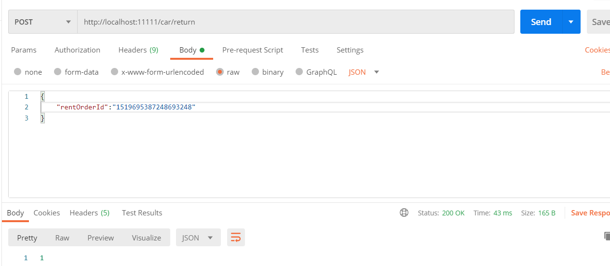

### 云部署
用的是腾讯云服务器，ip地址为：175.178.175.28，端口号为11111。
即对应的接口访问地址为http://175.178.175.28:11111/car

### 未来展望
这是一个非常轻量级的租车demo,没有做用户权限验证，只基于redis分布式锁实现了简单的车辆租赁、还车、新增、修改、删除、查询
以及对应的租车单的查询，后续如果需要完善可以加上权限验证，以及各种车辆分类库存以及出租价格等，出租单类似于订单。